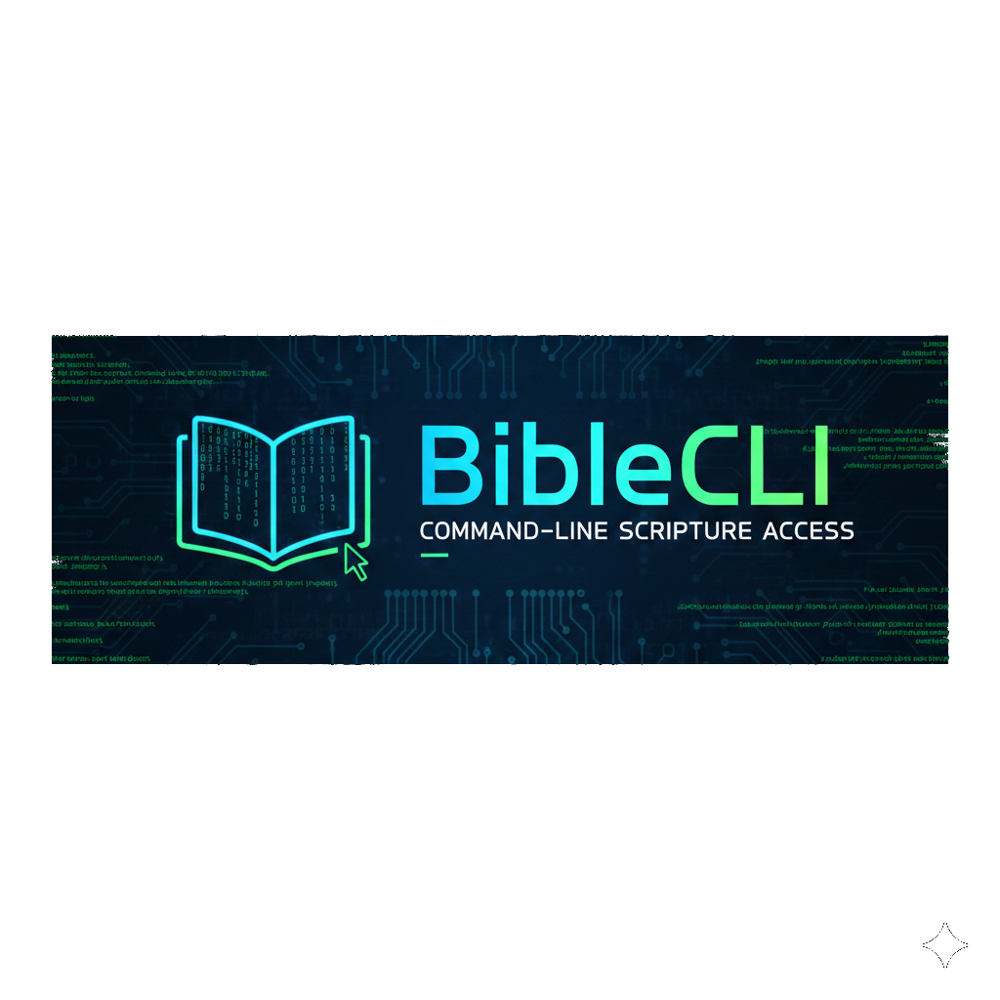

# 📖 BibleCLI

> Komut Arayüzü ile Bible okuma aracı. Terminalden ayrılmadan kutsal metinleri hızlıca arayın.
> **Kodlayan:** [Padros](https://github.com/Padrosum)


---



## 📖 Nedir?

**BibleCLI**, terminalinizden çıkmadan kutsal metinleri **hızlı**, **renkli** ve **çevrimdışı** olarak okumanızı sağlayan basit bir Bash scriptidir.

JSON tabanlı yerel veri setini `jq` aracılığıyla işler ve sonuçları (tek bir ayet, tüm bölüm veya mevcut kitap listesi) doğrudan terminalinizde estetik bir şekilde render eder.

### ✨ Özellikler

* 🚀 **Işık Hızında:** JSON tabanlı yerel veritabanı sayesinde anında sonuç.
* 🎨 **Renkli Arayüz:** Okumayı kolaylaştıran, göz yormayan ANSI renk paleti.
* 🔍 **Esnek Sorgulama:** İster tek bir ayet, ister koca bir bölümü argüman vererek okuma.
* 📦 **Çevrimdışı Çalışma:** Kurulumdan sonra internet bağlantısına ihtiyaç duymaz.

---

## ⚠️ Sorumluluk Reddi (Disclaimer)

Bu script "olduğu gibi" sağlanır. 

* Repo sahibi veya yazanlar script kullanımından doğan hiçbir zarardan sorumlu değildir. 
* Çalıştırmadan önce içeriği inceleyin ve üretimde kullanmadan önce test edin.

---

## 🛠️ Gereksinimler (Dependencies)

Bu aracı kullanabilmek için aşağıdaki araçların ve dosyaların sisteminizde olması gerekir:

* `jq` (JSON verilerini okumak için)
* `bash` (Script motoru)
* Yeterli disk alanı
* İnternet bağlantısı *(Sadece ilk kurulumda repoları çekmek için)*
* Script'in okuyabileceği formatta bulunan `.json` dosyaları. *(JSON veritabanı için **aruljohn/Bible-kjv**'ye özel teşekkürler)*

---

## ⚙️ Kurulum

Aşağıdaki komutlarla repoyu, JSON dosyalarını indirip scripti anında çalıştırılabilir hale getirebilirsiniz:

```bash
git clone https://github.com/Padrosum/BibleCLI
git clone https://github.com/aruljohn/Bible-kjv/
mv Bible-kjv/* BibleCLI/
rm -rf Bible-kjv
cd BibleCLI
chmod +x biblecli
./biblecli
